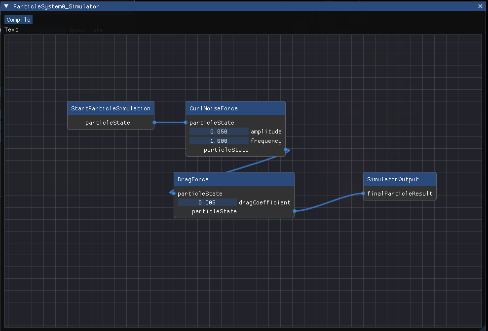
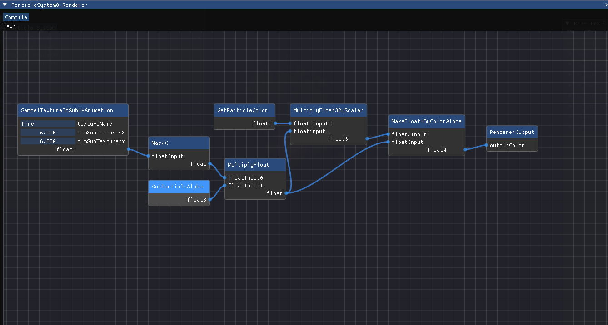

## Particle System

### 목차
[프로젝트 개요](#프로젝트-개요) <br>
[목표 및 계획](#목표-및-계획) <br>
[Tasks](#Tasks) <br>
[일지](#일지) <br>
[세부 구현 설명](#세부-구현-설명) <br>
[참고문헌](#참고문헌)

<hr/>

### 프로젝트 개요

단순한 수준의 파티클 시스템을 D3D12로 구현합니다. <br>
특히, **Simulation이 아닌 Particle Control에 집중**합니다. <br>


#### 구현 목표 Reference
* ***Unreal Engine 5 Niagara*** <br>
* [YouTube: ncParticleEditor](https://www.youtube.com/watch?v=RLNI5NMCJ1E) <br>
* [YouTube: OpenGL/Imgui Engine Build Stage 3.5: Particle System](https://www.youtube.com/watch?v=rZ3ztv7u0Yk) <br>
* [YouTube: 2D Game Particle tool using IMGUI in DirectX11](https://www.youtube.com/watch?v=TXf4D8Ess6s) <br>
* [YouTube: Compute Shader Particle System pt. 3, GUI](https://www.youtube.com/watch?v=UqB4paFZcBg) <br>
* [YouTube: Custom Particle Editor](https://www.youtube.com/watch?v=iQhOHd_JSgk) <br>

<hr/>

### 목표 및 계획

##### 1주차: 계획 선정 및 개발 환경 구성
* 주제 선정 및 조사
* D3D12 개발 환경 구성


##### 2~4주차: 핵심 기능 구현 및 Particle System 학습

* 학습
* D3D12 기초적 렌더러 구현
* emnitter, particle 등 핵심 기능 설계 및 구현
* Computing Shader 작성
  + EmitterCS 작성
  + SimulateCS 작성
* Particle Rendering 구현
  + VS, GS, PS 작성
* 단순한 수준의 particle simulation 구현 (i.e. sprinkler)
* z-buffer에 의한 particle occlusion
* *motion blur 구현 (진행 상황에 따라 수행)*
* *alpha-blending (진행 상황에 따라 수행)*
  + *SortingCS 작성*
  + *alpha-blending 구현*
* *geometry와의 collision (진행 상황에 따라 수행)*

##### 5~7주차: UI 도입 및 사용성, 확장성, 유지보수성 증대

* imgui 도입
* hard coding 되어 있을 다양한 값들 parameter화
* 유연한 particle control을 위한, 핵심 기능의 구조 개선
* 다양한 particle contorl을 위한, 기능 구현 (i.e. gravity, drag, noise, wind, ...)


##### 8주차: 마무리
* refactoring
* visuality 개선

#### 위험 요소
* Native한 D3D12로 진행 (Mini Engine 등 사용 X)
* Particle System 학습 미비
* imgui 사용 경험 없음

<hr/>

### Tasks

##### Backlogs
* Mesh(i.e. cube) render
* Particle에 Orientation 속성 추가
* Opaque particles를 먼저 draw해야 함
* Angular Velocity, Orientation 개념
* 프레임 통계 모듈
* Motion blur
* Collision
* Lighting
* Curl Noise를 Perlin Noise 기반으로
* Shader generation에서 node dependency 무결성 확인
  * i.e.) float3에 float4를 대입하지는 않는지?
  * 각 node들이 type 정보를 유지하여 적절한 input임을 검증해야 함
* 성능 이슈:
  *

##### 진행 중인 Task
*

##### 완료된 Tasks
* D3D12 개발 환경 구성 (+PIX 디버거)
* D3D12 기초적 렌더러 구현
* 간단한 수준의 Particle 생성/파괴, 시뮬레이션을 위한 Computing Shader 작성
* 간단한 수준의 Particle System을 위한 렌더링 파이프라인 구성
* 간단한 수준의 emitter, particle 등 핵심 기능 설계 및 구현
* Texture mapping 수행
* alpha blending 수행
* Sorting 구현 확인
  + Batcher's odd-even merge sort 학습
  + Bitonic sort 학습
  + 간단한 구현 수행 및 결과 확인
* HLSL Generator 구현
  * 추상화된 작업들을 HLSL 코드로 변환시켜주는 클래스
  * 가령 float4 변수를 초기화하고, 두 개의 float4 변수를 더하는 것 등
  * 이를 기반으로 유연한 Emit, Simulate process 구현의 기반 마련
* DrawIndexedIndirect(), ExecuteIndirect() 학습 및 적용
* UI:
  * Spawn rate 조절 가능
  * Emitter Shader 작성 가능
  * Simulator Shader 작성 가능
  * Renderer Shader 작성 가능
  * 새로운 Particle System 추가 가능
  * Particle System의 상태를 저장 및 로드
  * Opaque/Translucent 변환 가능
  * input node가 유효하지 않다면 컴파일하지 않음
* Simulation Node:
  * Vortex Force
  * Point Attraction Force
  * Drag Force
  * Curl Noise Force
* 불 렌더링
* Orphan node들을 shader code로 변환하지 않음
* Ribbon 렌더링
* 성능 이슈
  * ExecuteIndirect에서 적절한 maxCommandsCount를 넘기기 (관련 일지 - 4주차 목요일)

<hr/>

### 일지
 
##### 1주차: 계획 선정 및 개발 환경 구성 (2023.10.10. ~ 2023.10.13.)
* 수요일:
* 목요일:
  + D3D12 환경 구성
  + 렌더링 파이프라인 구성
* 금요일: 
  + PIX 디버거 숙지 및 환경 구성
  + 정육면체 렌더링 완료
  + 의사 난수 (https://stackoverflow.com/questions/4200224/random-noise-functions-for-glsl)
  + Emitter, Particle 자료구조 prototype
  + ParticleEmitterCS, ParticleSimulateCS prototype

<br> 

##### 2주차: 핵심 기능 구현 및 Particle System 학습 (2023.10.16. ~ 2023.10.20.)
* 월요일:
  + ParticleEmitterCS, ParticleSimulateCS 작성
  + Particle 렌더링을 위한 쉐이더 일부 작성
  + ParticleSimulateCS 버그: RWByteAddressBuffer의 InterlockedAdd, Store, Load 사용 코드에 문제가 있어 동기화가 제대로 수행되지 않음 - 해결: 쉐이더 코드가 아닌 CPU 코드에 문제가 있었음. 메모리 주소를 잘못 넘겨주어 비정상적인 값이 덮어 씌워지고 있었음.
* 화요일:
  + 여전히 RWByteAddressBuffer와 관련한 문제가 있었음: 단순히 UnorderedAccessBuffer로서 RootSiganture에서 다루어졌지만, RawBuffer는 반드시 UnorderedAccessView를 통해 DXGI_FORMAT_R32_TYPELESS 타입과 D3D12_BUFFER_UAV_FLAG_RAW 플래그를 지정해 다루어야 함! 지식이 부족해 이를 적용하지 않았고 문제가 발생하였던 것이었음.
  + 기본적인 파티클 렌더링 수행 완료 (100만 개)
    
  + 정해진 최대 파티클 수량을 넘을 시 생성하지 않도록 제한
* 수요일:
  + Index Buffer 타입이 16bit uint라 2^16 이상의 파티클을 다루면 문제가 발생하여 해결.
  + Particle의 평면이 항상 Camera를 바라보도록 함
  + ParticleSystem 클래스 설계 및 구현
  + 여러 개의 ParticleSystem을 관리할 수 있음 (아직은 각각의 particle system이 서로 다른 world transform만 가질 수 있음)
  + 간단한 텍스처 매핑 (성능: 대략 10만 개)
    
* 목요일:
  + 알파 블렌딩 수행
    
  + Spawn rate 조절 가능
  + Batcher's odd-even merge sort 학습
  + Bitonic sort 학습
  + Bitonic sort prototype (단순히 인덱스를 기준으로 정렬해보았음)
* 금요일:
  * 렌더링과 관련 없는 utils의 자동화 유닛 테스트 환경 구축
  * HlslTranslator (ParticleEmitter에만 시험적으로 적용)
    * Graph 자료구조 기반으로 hlsl을 생성하는 클래스
    * base shader 파일을 기반으로 특정 지점에 동적으로 코드 삽입 후 컴파일
  * Object hashing
    * 각 particle system 마다의 shader 관리를 위한 object 수준에서의 hashing 구현
    * 객체 생성 시점을 이용해 hashing 
  * DrawIndexedIndirect(), ExecuteIndirect() 학습

<br>

##### 3주차: 동적 쉐이더 컴파일 구현 및 UI 도입 (2023.10.23. ~ 2023.10.27.)
* 월요일:
  + Indirect Drawing 도입 (기존에는 무조건 최대 파티클 수만큼 draw call 생성)
  + 동적 쉐이더 컴파일 적용
    + Emit, Simulate, Render 단계에서의 연산을 동적으로 제어 가능
  + Imgui 학습 및 예제 적용
* 화요일:
  * imgui 도입 (+node graph 관련 library인 imnodes)
  * Emitter에 시험적 node editor 적용
    * node editor 기반으로 쉐이더 수정 가능
* 수요일:
  * UI 적용
    * Particle Emission, Simulation, Rendering 변경 가능
    * 노드 에디터의 정보들은 저장됨
      
* 목요일:
  * UI 적용
    * Particle System들의 상태를 저장할 수 있음
      * 다시 프로그램 시작 시 자동적으로 load
* 금요일:
  * Simulation Node 추가
    * Drag Force
    * Vortex Force
    * Point Attraction Force
  * Simulation 방식 변경
    * Velocity, Acceleration, Position을 누적해 변경하고 마지막에 Solving 됨
  * UI 적용
    * Node를 삭제할 수 있음
    * 각 Emitter, Simulator, Renderer Editor에서 사용할 수 있는 node들만 생성할 수 있음
  * 
  * 배경 변경(하늘색 -> 검은색)


##### 4주차: 각종 Simulation 힘 적용 및 Fire 렌더링 (2023.10.30. ~ 2023.11.03.)
* 월요일:
  + Perlin Noise 학습
  + Curl Noise를 활용하기 위한 구조적 개선
    + 각 Pass(Emitter, Simulator, Renderer)는 동적으로 리소스(텍스처)를 활용할 수 있음.
    + 어떤 Shader statement nodes로 구성되었느냐에 따라서 동적으로 root signature, pso, shader를 빌드
* 화요일:
  * Curl Noise 적용
  * 코드 리팩토링 및 구조적 개선
  * 
  * 위에서 파티클들이 초기에 burst 되는 것은 의도된 것이 아니며, 변경되는 deltaTime으로 인해서 정확한 파티클의 움직임이 계산되지 않은 결과임
* 수요일:
  * 이제 파티클의 size, color, opacity 등을 lifetime 기반으로 선형적으로 보간함
  * 노드 에디터 안정성 개선
    * 적절히 연결되지 않은 노드는 컴파일되지 않음
  * 각종 노드들 추가
  * 불 렌더링 시작
* 목요일:
  * 불 렌더링
  * 예시1: 
  * 예시2: 
  * 파티클이 별로 없음에도 유독 렌더링이 느려지는 현상을 경험함.
    * 원인: ExecuteIndirect 호출 시 적절하지 않은 최대 maxCommandsCount를 정의함. (2번째 인자)
    ``` c++
    // TODO: Optimization - Set proper NumMaxCommands.
    cmdList->ExecuteIndirect(
	    _commandSignature.Get(),
	    _resource->getMaxNumParticles(),
	    _resource->getIndirectCommandsResource(),
	    0,
	    _resource->getIndirectCommandsResource(),
	    _resource->getCommandBufferCounterOffset());
    ```
    * ExecuteIndirect 호출에서 commands의 수를 세는 counter buffer를 함께 넘기므로, maxCommandsCount가 실제 indirectComamnds의 개수에 비해 현저히 적더라도 별 문제 없을 것이라고 생각하였으나, 특정 GPU 드라이버들은 적절한 maxCommandsCount를 넘겨주어야만 좋은 성능을 낼 수 있음(출처: PIX 디버거 분석 도구)
    * 이와 관련한 tasks는 차후 최적화 단계에서 해결할 예정
  * Ribbon, Trail rendering 준비: Spline 학습
* 금요일:
  * Bitonic Sort의 동작을 PIX Debugger로 확인하는데 자꾸 이상한 결과가 나옴
    * 시각적으로는 괜찮아 보이는데, 디버거로 직접 값들을 보면 정렬이 제대로 안 되어 있는 것
    * 알고보니 GPU와 관련해서 Nvidia Control Panel을 통해 권한 설정을 해주어야 하는 것이 있었고, 이것이 제대로 이루어지지 않아 디버거의 초기화에 문제가 생겨서 발생한 현상으로 추측됨.
  * Bitonic Sort는 2의 n승 꼴로만 수행이 되어서, 이를 임의의 n 크기에서 수행할 수 있는 방법을 찾아보았으나..
    * [Arbitrary n size bitonic sort](https://hwlang.de/algorithmen/sortieren/bitonic/oddn.html) => 이걸 응용해볼 수 있을까? 머리가 아파서 생각을 그만두었음.
  * 어쨌거나 Bitonic sort를 만들어놨으니 이를 일단 활용하기로 함
    * 2^n에서 남는 자리들은 정렬의 최후순위 값으로 padding


##### 5주차: Ribbon 렌더링 (2023.11.06. ~ 2023.11.10.)
* 월요일:
  + 간단한 리본 렌더링 수행
  + 
  + 이제 Orphan nodes를 shader statements로 변환하지 않음
* 화요일:
  * 연차
* 수요일:
  * 리본 렌더링 텍스처 매핑 공부
* 목요일:
  * 리본 렌더링에서 distance based texture mapping 수행
  * brent-kung parallel prefix sum 학습 및 적용
* 금요일:
  * 코드 리팩토링


##### 6주차: 성능 개선 (2023.11.13. ~ 2023.11.17.)
* 월요일:
  * 코드 리팩토링
  * 4주차 목요일에 제시되었던 성능 이슈 해결
  * 성능 측정 환경 구성
* 화요일:
  * 이슈 발생:
    * 현상:
      * reserved된 파티클 버퍼의 길이를 넘어가는 수준으로 파티클이 생성된 시점 전후에 디바이스가 제거됨.
      * 가령 한 particle system이 최대 1만 개의 파티클을 관리할 수 있다면, 현재 파티클의 수와 상관 없이 대략 1만 개의 파티클을 생성한 시점 이후에 디바이스가 제거됨.
    * 재현 방법:
      * DebugLayer에서 [GPUbaseValidation 혹은 DRED auto-breadcrumb]를 하나라도 활성화하지 않을 시(둘 다 비활성화 시) 이상 현상 발생
      * 위 조건이더라도, 수직동기화를 사용 시 문제가 발생하지 않음
      * 프레임 최초의 compute shader dispatch인 particle emission은 정상 동작 함.
    * 직접적인 원인: 
      * UAV의 값 갱신이 제대로 되지 않는 것으로 추정
      * 살아있는 파티클의 수를 관리하는 counter가 비정상적인 UAV 값 갱신으로 인해 최대 파티클 수를 넘어가게 되고, 이로 인해 out of bounds access가 일어나는 것으로 추정
* 수요일:
  * 이슈 해결:
    * 원인: UAV를 사용하는 Dispatch 사이에 UAV Resource Barrier를 두지 않음
    * 질문: GPU based validation이나 auto-breadcrumb를 사용 시 자원들의 상태를 관리하기 위해서 삽입되는 코드들로 인해 이러한 문제가 드러나지 않은 것일까?
  * IndirectDrawing Timing?
    * 
    * ExecuteIndirect 명령 이전에 비정상적으로 긴 gpu 유휴가 확인됨 (마우스 커서 부분이 ExecuteIndirect)
    * 100만 개의 파티클을 그린 예인데, drawing 시간이 비정상적으로 짧은 것으로 보아 gpu 유휴로 보이는 부분들이 전부 drawing에 활용되는 시간이라 추정
    * 확인을 위해 Indirect Drawing을 시연하는 DirectX12 Sample의 timing 역시 측정해보았고 같은 현상을 볼 수 있었음.
  * 
* 목요일:
  * 성능 측정
  * 파티클 관리 방법 개선 구상

<hr/>

### 세부 구현 설명
#### 파티클 자원
* 파티클 정보를 담는 버퍼와 그 인덱스를 담기 위한 스택을 3개 사용
  + 파괴되어 있는 파티클들의 인덱스를 담는 스택 [deads]
    - 시작 시 스택이 가득 차있고, 각 원소는 0번부터 최대 파티클 수까지 초기화되어 있음. 
  + 살아있는 파티클들의 인덱스를 담는 스택 2개 (ping-pong) [alives1, alives2]
* RWbyteaddressbuffer.InterlockedAdd를 이용해 전역적으로 파티클의 수를 동기화

#### 파티클 생성
* 파티클 생성 시 각 스레드는 하나의 파티클을 생성함.
* 이때 deads 스택의 최상위에서 죽어 있는 파티클의 인덱스를 가져오며, 스택의 크기를 1 감소시킴
* 파티클을 초기화하고, alives 스택에 해당 파티클의 인덱스를 삽입함.

#### 파티클 파괴 및 시뮬레이션
* 각 스레드는 alives 버퍼에서 하나의 파티클을 시뮬레이션함.
* simulate 단계에서 파티클의 life가 0 미만이면 deads 스택에 해당 인덱스를 삽입함.
* 만약 여전히 살아있다면 시뮬레이션 연산을 마친 뒤 ping-pong 버퍼인 alives2 스택에 해당 파티클의 인덱스를 삽입함.

#### 파티클 정렬
* Batcher's odd-even merge sort:
  + 반절로 나누어 정렬한다
  + 짝수와 홀수 인덱스로 나누어 정렬한다.
  + (2l, 2l-1)을 비교해 정렬한다. 가령 8개의 원소일 경우 (2,3), (4,5), (6,7)
  + 이를 반복해 정렬 완료
* Bitnoic sort:
  + descending, ascneding order를 번갈아가면서 정렬함
  + 이들을 merge하는 작업들을 재귀적으로 수행하여 정렬 완료
* Bitonic sort가 더 빠른 이유?
  * data access 패턴이 규칙적이라 cache hit가 잘 이루어질 수 있음.

#### 쉐이더 동적 생성
* 예시:
``` c++
EmitCSBase.hlsl

// each thread emits a particle.
[numthreads(256, 1, 1)]
void EmitCS(
	int3 groupThreadId : SV_GroupThreadID,
	int3 dispatchThreadId : SV_DispatchThreadID)
{
	...
	%s

	newParticle.Color = float3(1.0f, 0.0f, 0.0f);

	// add particle into buffer
	// TODO: remove either numDeads or numAlives and derive it with max num of particles.
	uint numDeads;
	counters.InterlockedAdd(PARTICLECOUNTER_OFFSET_NUMDEADS, -1, numDeads);

	uint newParticleIndex = deadIndices[numDeads - 1];

	uint numAlives;
	counters.InterlockedAdd(PARTICLECOUNTER_OFFSET_NUMALIVES, 1, numAlives);
	
	aliveIndices[numAlives] = newParticleIndex;

	particles[newParticleIndex] = newParticle;
}
```


``` c++
7765567160042113517.hlsl

// each thread emits a particle.
[numthreads(256, 1, 1)]
void EmitCS(
	int3 groupThreadId : SV_GroupThreadID,
	int3 dispatchThreadId : SV_DispatchThreadID)
{
    ...

float3 local6 = float3(0.000000, 0.000000, 0.000000);
newParticle.Position = local6;
float3 local4 = float3(random(0.293304 + DeltaTime + float(dispatchThreadId.x)), random(0.393304 + DeltaTime + float(dispatchThreadId.x)), random(0.493304 + DeltaTime + float(dispatchThreadId.x)));
float3 local3 = float3(0.000000, -1.000000, 0.000000);
newParticle.Acceleration = local3;
float local2 = float(3.000000);
newParticle.Lifetime = local2;
float local1 = float(0.050000);
newParticle.Opacity = local1;
newParticle.Size = local1;
float3 local0 = float3(-0.500000, -0.500000, -0.500000);
float3 local5 = local4 + local0;
newParticle.Velocity = local5;

	// add particle into buffer
	// TODO: remove either numDeads or numAlives and derive it with max num of particles.
	uint numDeads;
	counters.InterlockedAdd(PARTICLECOUNTER_OFFSET_NUMDEADS, -1, numDeads);

	uint newParticleIndex = deadIndices[numDeads - 1];

	uint numAlives;
	counters.InterlockedAdd(PARTICLECOUNTER_OFFSET_NUMALIVES, 1, numAlives);
	
	aliveIndices[numAlives] = newParticleIndex;

	particles[newParticleIndex] = newParticle;
}
```

* Base 쉐이더 파일이 입력되며, statements가 삽입될 지점은 "%s"로 표시
* Graph 자료구조를 기반으로 statements의 dependency를 관리
* 이들을 위상 정렬 후 순차적으로 코드에 삽입
  * 깊이 우선 탐색의 후위 순서를 거꾸로 순회
* 클라이언트는 HlslGenerator 객체의 함수를 이용해 원하는 로직 생성
  * 구체적으로는 statement node를 생성 후 그들 간의 관계를 정의
  * 각 statement node는 고유한 번호가 존재
  * 예시:
``` c++
UINT positionIndex = _hlslGenerator->newFloat3(0.0f, 0.0f, 0.0f);

UINT randFloat3 = _hlslGenerator->randFloat3();
UINT minusHalfFloat3 = _hlslGenerator->newFloat3(-0.5f, -0.5f, -0.5f);
UINT velocityIndex = _hlslGenerator->addFloat3(randFloat3, minusHalfFloat3);

UINT accelerationIndex = _hlslGenerator->newFloat3(0.0f, -1.0f, 0.0f);

UINT lifetimeIndex = _hlslGenerator->newFloat(4.0f);

UINT sizeIndex = _hlslGenerator->newFloat(0.05f);

UINT opacityIndex = _hlslGenerator->newFloat(1.0f);

_hlslGenerator->setInitialPosition(positionIndex);
_hlslGenerator->setInitialVelocity(velocityIndex);
_hlslGenerator->setInitialAcceleration(accelerationIndex);
_hlslGenerator->setInitialLifetime(lifetimeIndex);
_hlslGenerator->setInitialSize(sizeIndex);
_hlslGenerator->setInitialOpacity(opacityIndex);

compileShaders();
```
* 이때 쉐이더의 최종 출력 값은 사전에 정해져 있음.
  * 가령 EmitCS의 경우 InitalPosition, InitialVelocity 따위를 최종 출력으로 받음.
* 생성된 Shader 파일들의 이름은 객체 생성 시점을 해싱한 값으로 구분
* 

#### 컬 노이즈
* 3차원 노이즈 텍스처를 생성 (R32G32B32FLOAT)
  * Perlin Noise를 이용할 예정이었으나, 그냥 단순 noise를 사용해도 나쁘지 않은 결과를 보이므로 차후로 미루었음
  * 
* 이는 벡터가 되며 파티클의 위치를 기반으로 텍스처를 linear sample해 얻은 값으로 velocity를 누적
* 


#### 불 렌더링

* 예시1: 
* 예시2: 
* 노드 에디터 예시:
  * 
  * 
  * 
* 구현 방법
  * Particle systems
    * 위로 올라가는 불꽃을 표현하는 particle system
    * 연기를 표현하는 particle system
    * 불씨를 표현하는 particle system
    * 중앙 불꽃을 표현하는 particle system
  * 불꽃과 연기는 subuv 텍스처를 이용해서 lifetime을 기반으로 애니메이팅됨.
    * 
    * 애니메이션 블렌딩은 하지 않았음!

#### 리본 렌더링
* 1차적 구현 목표:
  * https://youtu.be/Zn9-U5vQl3g?si=OwzghEU3Dq-Bh-fX&t=155
  * Spawntime 기반으로 particle 정렬 후
  * 이들을 지나는 spline(Catmull-rom) 렌더링
  * 적절한 레퍼런스를 찾지 못했으므로, 내 맘대로 구현한다!
* 정렬
  * Spawntime으로 하려고 했으나, 추가적인 인자가 필요함. 왜냐하면:
    * 한 프레임에서 같은 spawntime을 가진 여러 파티클들이 생성됨
    * Bitonic sort는 stable한 sort가 아닐 것이므로, spawntime이 같은 파티클들의 상대적 순서가 보존된다는 보장이 없음
    * 따라서 spawn 시 해당 dispatch thread id를 기록하고 이 역시 정렬에 관여하도록 설정
* Ribbon 생성
  * Tessellation을 이용
    * 입력: 4개의 Control points C0, C1, C2, C3
    * C1과 C2 위 아래로 점을 생성해 quad 구성 후 tessellation
    * 
    * Catmull-rom spline을 이용해 C1과 C2 사이 세분된 점들의 위치를 조정
    ``` C++
    ...
	float t = uv.x;

	float3 upPosU = catmullRom(
		ribbonPatch[0].ControlPoint0,
		ribbonPatch[0].ControlPoint1,
		ribbonPatch[0].ControlPoint2,
		ribbonPatch[0].ControlPoint3,
		t);

	float3 downPosU = catmullRom(
		ribbonPatch[1].ControlPoint0,
		ribbonPatch[1].ControlPoint1,
		ribbonPatch[1].ControlPoint2,
		ribbonPatch[1].ControlPoint3,
		t);

	float3 pos = lerp(upPosU, downPosU, uv.y);
    ...
    ```
  * Control Points 입력 방식
    * Index View Buffer는 0부터 maxParticleCount까지 채워져 있음
    * Indirect dispatch를 이용해 control points를 입력 조립기에 넣음
        ``` C++
        [numthreads(256, 1, 1)]
        void RibbonComputeIndirectCommandsCS(int3 dispatchThreadId : SV_DispatchThreadID)
        {
	        uint id = dispatchThreadId.x;
	        uint numAlives = counters.Load(PARTICLECOUNTER_OFFSET_NUMALIVES);

	        if (id >= numAlives - 3 || numAlives <= 3)
	        {
		        return;
	        }

	        IndirectCommand command;
	        command.IndexCountPerInstance = 4;
	        command.InstanceCount = 1;
	        command.StartIndexLocation = id;
	        command.BaseVertexLocation = 0;
	        command.StartInstanceLocation = 0;

	        outputCommands.Append(command);
        }
        ```
    * 
    * 문제점: 0\~1과 n-1\~n의 ribbon이 연결되지 않음.
    * 따라서 index buffer의 앞 부분에 0을 추가로 삽입하여 첫 번째 ribbon의 경우 control point가 0, 0, 1, 2로 입력되게 하여 0~1의 파티클을 잇게 함.
    * 마찬가지로 마지막 ribbon의 경우 numAlives를 확인해서 해당 index를 보정하게끔 함 (n-2, n-1, n, n+1) => (n-2, n-1, n, n)
    * 이는 vid로 입력이 되며, 이를 인덱스로 이용해 particle buffer에 접근
  * Color, Opacity interpolation
    * Pixel shader까지 각 segment의 uv값을 전달하며, 이를 이용해 spline 보간한 것과 같은 방식으로 보간.
  * Texture Coordinate
    * 실험을 위한 texture: 
      * 
    * 3가지 형태로 Texture mapping을 해보았음: Segment based, Stretched, Distance based
    * Segment based
      * 각 파티클들을 잇는 하나의 segment가 0~1의 Texture Coordinate를 가짐
      * 
      * 
    * Stretched
      * 시작 파티클부터 끝 파티클까지 0~1의 Texture Coordinate를 가짐
      * 
      * 
    * Distance based
      * 세계 좌표 기준으로 파티클 사이의 거리를 근사해 거리를 기준으로 texture coordinate를 부여해 tiling함
      * 
      * 
      * Catmull-rom spline이 이루는 호의 길이를 구해보려 했으나 이는 어려움
      * 만들어지는 spline의 곡률이 생각보다 크지 않고 방향 전환도 급격하게 이루어지므로, 단순히 직선 거리를 이용해서 근사해도 적절한 결과물이 나올 것이라고 생각하였음
      * i번째 파티클과 i-1번째 파티클 사이의 거리를 전부 구하고 이를 각각의 파티클들이 정보를 유지하지만, 이것만으로는 부족함
        * 왜냐하면 tiling이 자연스럽게 이루어지게 하기 위해서는 이전 segment의 텍스처 좌표값을 알아야 하기 때문!
        * 즉, "누적합"이 필요함
        * 
      * 누적합은 Brent-kung adder를 이용해 병렬적으로 연산하였음
        * 
      * 이를 통해 첫 파티클로부터 각 파티클까지의 거리를 계산할 수 있으며, 이 값을 그대로(혹은 scaling하여) texture coordinate로 활용함

#### 성능 개선 기록
* PIX Debugger를 활용하였음 (각 패스에서 이벤트 마킹) [WinPixEventRuntime](https://devblogs.microsoft.com/pix/winpixeventruntime/)
* 다양한 상황을 고려하여 시간을 측정하였음
  * 파티클의 수(1000, 1000000)
  * 렌더링 방법(스프라이트, 리본)
  * 블렌딩 방법(불투명, 반투명)
* 성능 측정 환경 구성
  * 해상도: FHD (보다 약간 작음)
  * 파티클은 화면 전체에 분포되어 렌더링
  * Lifetime: 3s
  * 예시
    * Sprite
      * 
    * Ribbon
      * 
* 성능 측정 
  * 개선 이전

    | \# of Particles | Renderer Type | Blending Type | Ribbon UV Mode    | Emission | Simulation | Post-simulation | Pre-sort | Sort     | Pre-prefix Sum | Prefix Sum | Computing Indirect Commands | Indirect Drawing | Total     |
    | --------------- | ------------- | ------------- | ----------------- | -------- | ---------- | --------------- | -------- | -------- | -------------- | ---------- | --------------------------- | ---------------- | --------- |
    | 1,000,000       | Sprite        | Opaque        | \-                | 0.074592 | 11.902528  | 0.001088        | 0.000000 | 0.000000 | 0.000000       | 0.000000   | 0.516608                    | 13.619712        | 26.114528 |
    | 10,000          | Ribbon        | Opaque        | Segment based     | 0.005984 | 0.057088   | 0.001088        | 0.042048 | 0.450976 | 0.000000       | 0.000000   | 0.032448                    | 4.077952         | 4.667584  |
    | 10,000          | Ribbon        | Opaque        | Distance based UV | 0.005216 | 0.059200   | 0.001088        | 0.042208 | 0.463328 | 0.038752       | 0.873888   | 0.032352                    | 3.980608         | 5.496640  |

* 파티클 시스템 구조
  * 
  * 1차적 목표: numDeads는 numAlives와 maxParticleCount에 의해서 유도될 수 있다. (atomic operation 필요 X)
  * 질문: 지금은 인덱스만을 다루고 이를 기반으로 파티클 버퍼를 참조하고 있는데, 인덱스가 아니라 직접 파티클 버퍼를 다루고 값을 다루는 형태로 바꾸면 성능이 많이 개선될까?
<hr/>

### 참고문헌 및 코드
* Particle System
  * [William T. Reeves, particle systems - a technique for modeling a class of fuzzy objects](https://www.lri.fr/~mbl/ENS/IG2/devoir2/files/docs/fuzzyParticles.pdf)
  * [Lutz Lata, Building a Million Particle System](https://citeseerx.ist.psu.edu/document?repid=rep1&type=pdf&doi=b5aa42d88a178b264f4ceb3ddb67d3d00ecbc631)
  * [Karl Sims, Particle animation and rendering using data parallel computation](https://www.karlsims.com/papers/ParticlesSiggraph90.pdf)
  * [GPU based paritlce system - Wicked engine](https://wickedengine.net/2017/11/07/gpu-based-particle-simulation/)
  * DirectX12 Mini Engine

* Parallel sort
  * [Bathcer's Algorithm](https://math.mit.edu/~shor/18.310/batcher.pdf)
  * [Bitonic sorter](https://en.wikipedia.org/wiki/Bitonic_sorter)

* Ribbon Trail
  * [Ribbon and Trail](https://doc.stride3d.net/4.0/en/manual/particles/ribbons-and-trails.html)
  * [Smooth Particle Ribbons Through Hardware Accelerated Tessellation](https://www.diva-portal.org/smash/get/diva2:1692949/FULLTEXT01.pdf) - 여기에 나온 방법론을 활용하지는 않았음.
  * [Bezier Curve](https://www.particleincell.com/2012/bezier-splines/)
  * [Catmull-Rom Curve](https://en.wikipedia.org/wiki/Centripetal_Catmull%E2%80%93Rom_spline)
  * [Catmull-Rom Spline](https://www.mvps.org/directx/articles/catmull/)
  * [Parallel Prefix Sum - Nvidia](https://developer.nvidia.com/gpugems/gpugems3/part-vi-gpu-computing/chapter-39-parallel-prefix-sum-scan-cuda)
  * [Parallel Prefix Sum - Open Source in Github](https://github.com/b0nes164/GPUPrefixSums/tree/main)

* Perlin Noise
  * [Perlin Noise](https://en.wikipedia.org/wiki/Perlin_noise)

