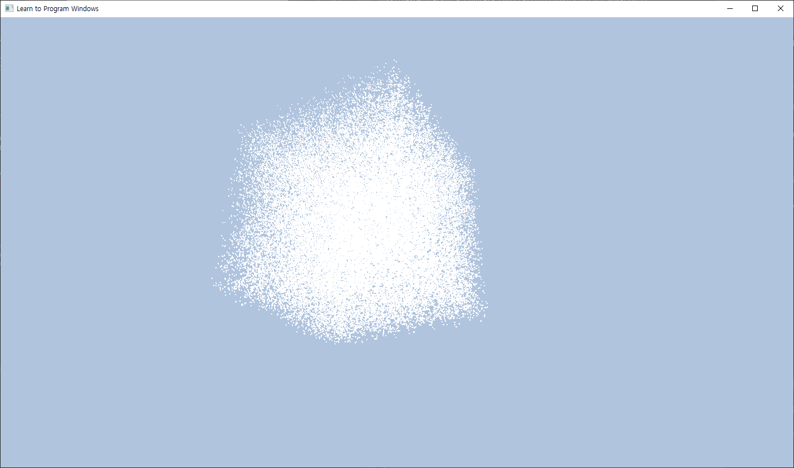

## Particle System

### 목차
[프로젝트 개요](#프로젝트-개요)  
[목표 및 계획](#목표-및-계획)  
[Tasks](#Tasks)  
[일지](#일지)  
[세부 구현 설명](#세부-구현-설명)  
[참고문헌](#참고문헌)

### 프로젝트 개요

단순한 수준의 파티클 시스템을 D3D12로 구현합니다.  
특히, **Simulation이 아닌 Particle Control에 집중**합니다.  

#### 구현 목표 Reference
* Unreal Engine 5 Niagara  
* [YouTube: ncParticleEditor](https://www.youtube.com/watch?v=RLNI5NMCJ1E)  
* [YouTube: OpenGL/Imgui Engine Build Stage 3.5: Particle System](https://www.youtube.com/watch?v=rZ3ztv7u0Yk)  
* [YouTube: 2D Game Particle tool using IMGUI in DirectX11](https://www.youtube.com/watch?v=TXf4D8Ess6s)  
* [YouTube: Compute Shader Particle System pt. 3, GUI](https://www.youtube.com/watch?v=UqB4paFZcBg)  
* [YouTube: Custom Particle Editor](https://www.youtube.com/watch?v=iQhOHd_JSgk)  

### 목표 및 계획

##### 1주차: 계획 선정 및 개발 환경 구성
* 주제 선정 및 조사
* D3D12 개발 환경 구성

##### 2~4주차: 핵심 기능 구현 및 Particle System 학습

* 학습
* D3D12 기초적 렌더러 구현
* emnitter, particle 등 핵심 기능 설계 및 구현
* Computing Shader 작성
  + EmitterCS 작성
  + SimulateCS 작성
* Particle Rendering 구현
  + VS, GS, PS 작성
* 단순한 수준의 particle simulation 구현 (i.e. sprinkler)
* z-buffer에 의한 particle occlusion
* *motion blur 구현 (진행 상황에 따라 수행)*
* *alpha-blending (진행 상황에 따라 수행)*
  + *SortingCS 작성*
  + *alpha-blending 구현*
* *geometry와의 collision (진행 상황에 따라 수행)*

##### 5~7주차: UI 도입 및 사용성, 확장성, 유지보수성 증대

* imgui 도입
* hard coding 되어 있을 다양한 값들 parameter화
* 유연한 particle control을 위한, 핵심 기능의 구조 개선
* 다양한 particle contorl을 위한, 기능 구현 (i.e. gravity, drag, noise, wind, ...)

##### 8주차: 마무리
* refactoring
* visuality 개선

#### 위험 요소
* Native한 D3D12로 진행 (Mini Engine 등 사용 X)
* Particle System 학습 미비
* imgui 사용 경험 없음

### Tasks

##### 진행 중인 Task
* Particle System 학습
* Lifetime, velocity 등 GPU 코드에서 하드코딩 된 속성들을 CPU 단에서 매개변수화
* 프레임 통계 모듈 구현
* HLSL Translator 구현
  * 추상화된 작업들을 HLSL 코드로 변환시켜주는 클래스
  * 가령 float4 변수를 초기화하고, 두 개의 float4 변수를 더하는 것 등
  * 이를 기반으로 유연한 Emit, Simulate process 구현의 기반 마련

##### 완료된 Tasks
* D3D12 개발 환경 구성 (+PIX 디버거)
* D3D12 기초적 렌더러 구현
* 간단한 수준의 Particle 생성/파괴, 시뮬레이션을 위한 Computing Shader 작성
* 간단한 수준의 Particle System을 위한 렌더링 파이프라인 구성
* 간단한 수준의 emitter, particle 등 핵심 기능 설계 및 구현
* Texture mapping 수행
* alpha blending 수행
* Sorting 구현 확인
  + Batcher's odd-even merge sort 학습
  + Bitonic sort 학습
  + 간단한 구현 수행 및 결과 확인

### 일지
 
##### 1주차: 계획 선정 및 개발 환경 구성 (2023.10.10. ~ 2023.10.13.)
* 수요일:
* 목요일:
  + D3D12 환경 구성
  + 렌더링 파이프라인 구성
* 금요일: 
  + PIX 디버거 숙지 및 환경 구성
  + 정육면체 렌더링 완료
  + 의사 난수 (https://stackoverflow.com/questions/4200224/random-noise-functions-for-glsl)
  + Emitter, Particle 자료구조 prototype
  + ParticleEmitterCS, ParticleSimulateCS prototype

  

##### 2주차: 핵심 기능 구현 및 Particle System 학습 (2023.10.16. ~ 2023.10.20.)
* 월요일:
  + ParticleEmitterCS, ParticleSimulateCS 작성
  + Particle 렌더링을 위한 쉐이더 일부 작성
  + ParticleSimulateCS 버그: RWByteAddressBuffer의 InterlockedAdd, Store, Load 사용 코드에 문제가 있어 동기화가 제대로 수행되지 않음 - 해결: 쉐이더 코드가 아닌 CPU 코드에 문제가 있었음. 메모리 주소를 잘못 넘겨주어 비정상적인 값이 덮어 씌워지고 있었음.
* 화요일:
  + 여전히 RWByteAddressBuffer와 관련한 문제가 있었음: 단순히 UnorderedAccessBuffer로서 RootSiganture에서 다루어졌지만, RawBuffer는 반드시 UnorderedAccessView를 통해 DXGI_FORMAT_R32_TYPELESS 타입과 D3D12_BUFFER_UAV_FLAG_RAW 플래그를 지정해 다루어야 함! 지식이 부족해 이를 적용하지 않았고 문제가 발생하였던 것이었음.
  + 기본적인 파티클 렌더링 수행 완료 (100만 개)
    
  + 정해진 최대 파티클 수량을 넘을 시 생성하지 않도록 제한
* 수요일:
  + Index Buffer 타입이 16bit uint라 2^16 이상의 파티클을 다루면 문제가 발생하여 해결.
  + Particle의 평면이 항상 Camera를 바라보도록 함
  + ParticleSystem 클래스 설계 및 구현
  + 여러 개의 ParticleSystem을 관리할 수 있음 (아직은 각각의 particle system이 서로 다른 world transform만 가질 수 있음)
  + 간단한 텍스처 매핑 (성능: 대략 10만 개)
    
* 목요일:
  + 알파 블렌딩 수행
    
  + Spawn rate 조절 가능
  + Batcher's odd-even merge sort 학습
  + Bitonic sort 학습
  + Bitonic sort prototype (단순히 인덱스를 기준으로 정렬해보았음)

### 세부 구현 설명
#### 파티클 자원
* 파티클 정보를 담는 버퍼와 그 인덱스를 담기 위한 스택을 3개 사용
  + 파괴되어 있는 파티클들의 인덱스를 담는 스택 [deads]
    - 시작 시 스택이 가득 차있고, 각 원소는 0번부터 최대 파티클 수까지 초기화되어 있음. 
  + 살아있는 파티클들의 인덱스를 담는 스택 2개 (ping-pong) [alives1, alives2]
* RWbyteaddressbuffer.InterlockedAdd를 이용해 전역적으로 파티클의 수를 동기화

#### 파티클 생성
* 파티클 생성 시 각 스레드는 하나의 파티클을 생성함.
* 이때 deads 스택의 최상위에서 죽어 있는 파티클의 인덱스를 가져오며, 스택의 크기를 1 감소시킴
* 파티클을 초기화하고, alives 스택에 해당 파티클의 인덱스를 삽입함.

#### 파티클 파괴 및 시뮬레이션
* 각 스레드는 alives 버퍼에서 하나의 파티클을 시뮬레이션함.
* simulate 단계에서 파티클의 life가 0 미만이면 deads 스택에 해당 인덱스를 삽입함.
* 만약 여전히 살아있다면 시뮬레이션 연산을 마친 뒤 ping-pong 버퍼인 alives2 스택에 해당 파티클의 인덱스를 삽입함.

#### 파티클 정렬
* Batcher's odd-even merge sort:
  + 반절로 나누어 정렬한다
  + 짝수와 홀수 인덱스로 나누어 정렬한다.
  + (2l, 2l-1)을 비교해 정렬한다. 가령 8개의 원소일 경우 (2,3), (4,5), (6,7)
  + 이를 반복해 정렬 완료
* Bitnoic sort:
  + descending, ascneding order를 번갈아가면서 정렬함
  + 이들을 merge하는 작업들을 재귀적으로 수행하여 정렬 완료
* Bitonic sort가 빠른 이유?
  * data access 패턴이 규칙적이라 cache hit가 잘 이루어질 수 있음.

### 참고문헌
[William T. Reeves, particle systems - a technique for modeling a class of fuzzy objects](https://www.lri.fr/~mbl/ENS/IG2/devoir2/files/docs/fuzzyParticles.pdf)  
[Lutz Lata, Building a Million Particle System](https://citeseerx.ist.psu.edu/document?repid=rep1&type=pdf&doi=b5aa42d88a178b264f4ceb3ddb67d3d00ecbc631)  
[Karl Sims, Particle animation and rendering using data parallel computation](https://www.karlsims.com/papers/ParticlesSiggraph90.pdf)  
[Bathcer's Algorithm](https://math.mit.edu/~shor/18.310/batcher.pdf)
